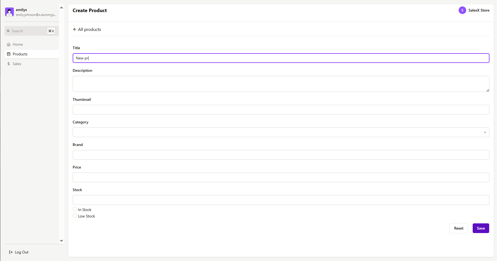

# Admin Dashboard for SalesX store

Authenticate as a SalesX manager and gain access to dynamic charts and a product management table for overseeing operations in the store!

## Table of Content

1. [Pages UI](#pages-ui)  
   1.1 [Auth](#auth)  
   1.2 [Home](#home)  
   1.3 [Products](#products)  
    1.4 [Product](#product)  
    1.4.1 [Edit](#edit)  
    1.4.2 [Create](#create)  
   1.5 [Sales](#sales)
2. [Deploy Link](#deploy-link)
3. [How to locally run the app](#how-to-locally-run-the-app)
4. [Features](#features)
5. [Important comments](#important-comments)
6. [Used technologies](#used-technologies)

## Pages UI

### Auth

Auth Page: choose an account to continue with


### Home

Home Page: gain insight on store operations with stat cards and charts


### Products

Products Page: navigate through the product table using search functionality, sorting options, and pagination parameters


### Product

Product Page: get detailed information about a product, including reviews and shipping options


#### Edit

Edit Product Page: update existing product


#### Create

Create Product Page: fill in the inputs to create a new product


### Sales

Sales Page: gain insight on sales data with stat cards and charts


## Deploy Link

Access application via this [link](https://salesx-admin-dashboard.netlify.app/auth)

## How to locally run the app

#### 0. Prerequisities:

- If you don't have `Node.js` on your PC, install it [here](https://nodejs.org/en/download) (use version **20.18.0** or above)

- Verify `node` version

```bash
node -v // Should print "v20.18.0" or above.
```

- Verify `npm` version

```bash
npm -v // Should print "10.9.0" or above.
```

#### 1. Clone repository:

```bash
git clone https://github.com/PikuzaMarie/admin-dashboard.git
```

#### 2. Go to the directory:

```bash
cd admin-dashboard
```

#### 3. Install dependencies:

```bash
npm install
```

#### 4. Start the app

it will automatically run in your default browser at http://localhost:3000/

```bash
npm run dev
```

## Features

- [x] **Authentication**: Secure login using JWT with automatic logout upon token expiration
- [x] **Product Table Management**: Search, sort, customize items per page, and navigate between pages
- [x] **Product Operations**: Create, read, and update (CRU) products seamlessly
- [x] **Configurable Product Fetching**: Dynamic async thunk (`fetchProducts`) for integrating sorting, search, and pagination parameters in API requests
- [x] **Redux Middleware**: Project includes `sessionStorageMiddleware` for saving and retrieving new products in/from `sessionStorage`
- [x] **Command Menu**: Quick navigation accessible via the `Ctrl/Command + K` shortcut
- [x] **Animated Charts**: Interactive visualizations powered by `Recharts` and `Framer Motion`

### Extra

- [x] **Optimized Requests to API**: Utilization of async thunk with `condition` to prevent duplicate server requests. The `searchTerm` is debounced using the custom `useDebounce` hook to minimize unnecessary requests
- [x] **Performance Optimization**: Faster loading speeds achieved using `useCallback` and `memo` to reduce unnecessary re-renders
- [x] **Non existent routes handling**: Dedicated `NotFoundPage` for non-existent routes
- [x] **Search Form with Debounce**:

## Important Comments

- **Predefined User Authentication**: Authentication is restricted to predefined user data, which is a server limitation. Therefore, on the login page, users must select a predefined user instead of manually entering credentials

- **Page Reload Behavior**: Upon reloading the page, the user is redirected to the auth page. In the future, logic will be added to verify the presence of authorization data in `localStorage` to maintain access for the currently selected user

- **Product Field Update Limitations**: Not all product fields can be updated due to server settings. As a result, the product editing form contains fewer fields compared to the product details page

- **Product Creation Limitations**: Due to server-specific constraints, only one product with a new unique ID and limited quantity of fields can be created. In the application, you can create a single new product, which will appear in the product table. However, detailed viewing of this product is not possible. Subsequent product creations will overwrite the previous one

## Server API

This project leverages [DummyJSON API](https://dummyjson.com/docs), an excellent resource for implementing authentication logic and retrieving structured JSON data

## Used technologies

- **_node.js_** - JavaScript runtime built on the V8 engine for executing server-side code
- **_react_** - library for building user interfaces with a focus on component-driven architecture
- **_typescript_** - strongly typed programming language that enhances code reliability and reduces bugs

---

- **_react-router-dom_** - routing library for managing navigation and dynamic URLs in React apps

---

- **redux toolkit** - streamlined state management library for React applications

---

- **_tailwind css_** - utility-first CSS framework for designing responsive and customizable user interfaces
- **_[feather react-icons](https://react-icons.github.io/react-icons/icons/fi/)_** - open source react icons, minimalistic and elegant
- **_[cmdk](https://github.com/pacocoursey/cmdk)_** - a command menu React component

---

- **_recharts_** - charting library built with React for creating data visualizations
- **_framer-motion_** - React animation library for designing smooth and complex animations

---

- **_eslint_** - linting tool that ensures code quality and consistency for JavaScript
- **_prettier_** - automatic code formatting tool to maintain clean and readable code
- **_imple-import-sort_** - eslint plugin for easy autofixable import sorting

---

- **_vite_** - fast build tool and development server for modern web applications

---

- **_jwt (JSON web token)_** - method for securely transmitting information, commonly used for authentication
